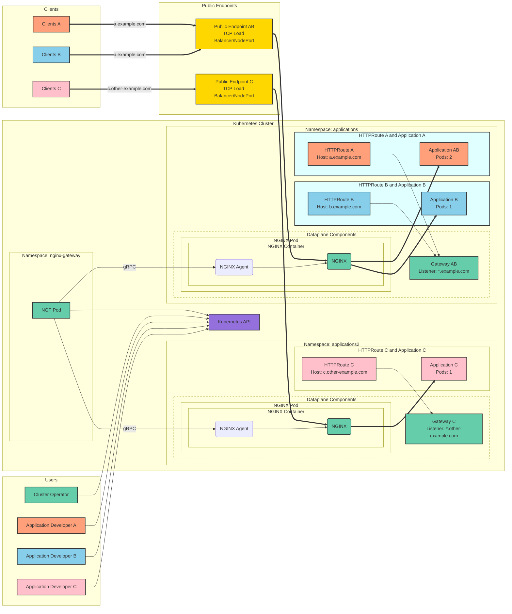
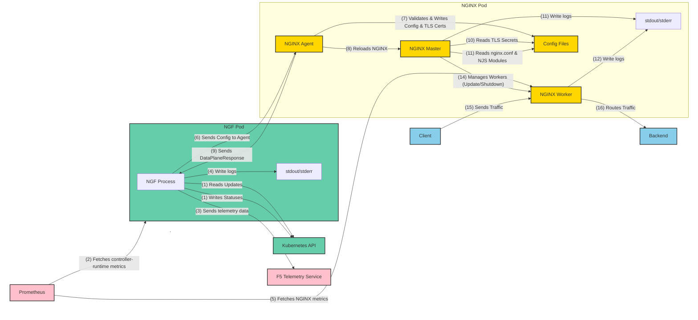

Learn about the architecture and design principles of NGINX Gateway Fabric.

The intended audience for this information is primarily the two following groups:

- _Cluster Operators_ who would like to know how the software works and understand how it can fail.
- _Developers_ who would like to [contribute](https://github.com/nginx/nginx-gateway-fabric/blob/main/CONTRIBUTING.md) to the project.

The reader needs to be familiar with core Kubernetes concepts, such as pods, deployments, services, and endpoints. For an understanding of how NGINX itself works, you can read the ["Inside NGINX: How We Designed for Performance & Scale"](https://www.nginx.com/blog/inside-nginx-how-we-designed-for-performance-scale/) blog post.

---

## Overview

NGINX Gateway Fabric is an open source project that provides an implementation of the [Gateway API](https://gateway-api.sigs.k8s.io/) using [NGINX](https://nginx.org/) as the data plane. The goal of this project is to implement the core Gateway APIs -- _Gateway_, _GatewayClass_, _HTTPRoute_, _GRPCRoute_, _TCPRoute_, _TLSRoute_, and _UDPRoute_ -- to configure an HTTP or TCP/UDP load balancer, reverse proxy, or API gateway for applications running on Kubernetes. NGINX Gateway Fabric supports a subset of the Gateway API.

For a list of supported Gateway API resources and features, see the [Gateway API Compatibility]() documentation.

NGINX Gateway Fabric separates the control plane and data plane into distinct deployments. This architectural separation enhances scalability, security, and operational isolation between the two components.

The control plane interacts with the Kubernetes API, watching for Gateway API resources. When a new Gateway resource is provisioned, it dynamically creates and manages a corresponding NGINX data plane Deployment and Service. This ensures that the system can adapt to changes in the cluster state seamlessly.

Each NGINX data plane pod consists of an NGINX container integrated with the [NGINX agent](https://github.com/nginx/agent). The agent securely communicates with the control plane using gRPC. The control plane translates Gateway API resources into NGINX configurations and sends these configurations to the agent to ensure consistent traffic management.

This design enables centralized management of multiple Gateways while ensuring that each NGINX instance stays aligned with the cluster's current configuration. Labels, annotations, and infrastructure settings such as service type or replica count can be specified globally via the Helm chart or customized per Gateway using the enhanced NginxProxy CRD and the Gateway's `infrastructure` section.

We have more information regarding our [design principles](https://github.com/nginx/nginx-gateway-fabric/blob/v1.6.1/docs/developer/design-principles.md) in the project's GitHub repository.

---

## NGINX Gateway Fabric Deployment Model and Architectural Overview

The NGINX Gateway Fabric architecture separates the control plane and data plane into distinct and independent Deployments, ensuring enhanced security, flexibility, and resilience.

### Control Plane: Centralized Management

The control plane operates as a Deployment, serving as a [Kubernetes controller](https://kubernetes.io/docs/concepts/architecture/controller/) built with the [controller-runtime](https://github.com/kubernetes-sigs/controller-runtime) library. It manages all aspects of resource provisioning and configuration for the NGINX data planes by watching Gateway API resources and other Kubernetes objects such as Services, Endpoints, and Secrets.

Key functionalities include:

- Dynamic provisioning: When a new Gateway resource is created, the control plane automatically provisions a dedicated NGINX Deployment and exposes it using a Service.
- Configuration management: Kubernetes and Gateway API resources are translated into NGINX configurations, which are securely delivered to the data plane pods via a gRPC connection to the NGINX Agent.
- Secure communication: By default, the gRPC connection uses self-signed certificates generated during installation. Integration with [cert-manager](https://cert-manager.io/) is also supported for optional certificate management.

### Data Plane: Autonomous Traffic Management

Each NGINX data plane pod is provisioned as an independent Deployment containing an `nginx` container. This container runs both the `nginx` process and the [NGINX agent](https://github.com/nginx/agent), which is responsible for:

- Applying configurations: The agent receives updates from the control plane and applies them to the NGINX instance.
- Handling reloads: NGINX Agent handles configuration reconciliation and reloading NGINX, eliminating the need for shared volumes or Unix signals between the control plane and data plane pods.

With this design, multiple NGINX data planes can be managed by a single control plane, enabling fine-grained, Gateway-specific control and isolation.

### Gateway Resource Management

The architecture supports flexible operation and isolation across multiple Gateways:

- Concurrent Gateways: Multiple Gateway objects can run simultaneously within a single installation.
- 1:1 resource mapping: Each Gateway resource corresponds uniquely to a dedicated data plane deployment, ensuring clear delineation of ownership and operational segregation.

### Resilience and Fault Isolation

One of the primary advantages of this architecture is enhanced operational resilience and fault isolation:

#### Control Plane Resilience

In the event of a control plane failure or downtime:
- Existing data plane pods continue serving traffic using their last-valid cached configurations.
- Updates to routes or Gateways are temporarily paused, but stable traffic delivery continues without degradation.
- Recovery restores functionality, resynchronizing configuration updates seamlessly.

#### Data Plane Resilience

If a data plane pod encounters an outage or restarts:
- Only routes tied to the specific linked Gateway object experience brief disruptions.
- Configurations automatically resynchronize with the data plane upon pod restart, minimizing the scope of impact.
- Other data plane pods remain unaffected and continue serving traffic normally.

This split architecture ensures operational boundaries between the control plane and data plane, delivering improved scalability, security, and robustness while minimizing risks associated with failures in either component.

---

## High-Level Example of NGINX Gateway Fabric in Action

This figure depicts an example of NGINX Gateway Fabric exposing three web applications within a Kubernetes cluster to clients on the internet:

 The figure does not show many of the necessary Kubernetes resources the Cluster Operators and Application Developers need to create, like deployment and services. 

The figure shows:

- A _Kubernetes cluster_.
- Users _Cluster Operator_, _Application Developer A_, _B_ and _C_. These users interact with the cluster through the Kubernetes API by creating Kubernetes objects.
- _Clients A_, _B_, and _C_ connect to _Applications A_, _B_, and _C_ respectively, which the developers have deployed.
- The _NGF Pod_, [deployed by _Cluster Operator_]() in the namespace _nginx-gateway_. For scalability and availability, you can have multiple replicas. The _NGF_ container interacts with the Kubernetes API to retrieve the most up-to-date Gateway API resources created within the cluster. When a new Gateway resource is provisioned, the control plane dynamically creates and manages a corresponding NGINX data plane Deployment and Service. It watches the Kubernetes API and dynamically configures these _NGINX_ deployments based on the Gateway API resources, ensuring proper alignment between the cluster state and the NGINX configuration.
- The _NGINX Pod_ consists of an NGINX container and the integrated NGINX agent, which securely communicates with the control plane over gRPC. The control plane translates Gateway API resources into NGINX configuration, and sends the configuration to the agent.
- Gateways _Gateway AB_ and _Gateway C_, created by _Cluster Operator_, request points where traffic can be translated to Services within the cluster. _Gateway AB_, includes a listener with a hostname `*.example.com`. _Gateway C_, includes a listener with a hostname `*.other-example.com`. Application Developers have the ability to attach their application's routes to the _Gateway AB_ if their application's hostname matches `*.example.com`, or to _Gateway C_ if their application's hostname matches `*.other-example.com`
- _Application A_ with two pods deployed in the _applications_ namespace by _Application Developer A_. To expose the application to its clients (_Clients A_) via the host `a.example.com`, _Application Developer A_ creates _HTTPRoute A_ and attaches it to `Gateway AB`.
- _Application B_ with one pod deployed in the _applications_ namespace by _Application Developer B_. To expose the application to its clients (_Clients B_) via the host `b.example.com`, _Application Developer B_ creates _HTTPRoute B_ and attaches it to `Gateway AB`.
- _Application C_ with one pod deployed in the _applications2_ namespace by _Application Developer C_. To expose the application to its clients (_Clients C_) via the host `c.other-example.com`, _Application Developer C_ creates _HTTPRoute C_ and attaches it to `Gateway C`.
- _Public Endpoint AB_, and _Public Endpoint C_ and  which fronts the _NGINX AB_, and _NGINX C_ pods respectively. A public endpoint is typically a TCP load balancer (cloud, software, or hardware) or a combination of such load balancer with a NodePort service. _Clients A_ and _B_ connect to their applications via the _Public Endpoint AB_, and _Clients C_ connect to their applications via the _Public Endpoint C_.
- The bold arrows represent connections related to the client traffic. Note that the traffic from _Clients C_ to _Application C_ is completely isolated from the traffic between _Clients A_ and _B_ and _Application A_ and _B_ respectively.

The resources within the cluster are color-coded based on the user responsible for their creation.
For example, the Cluster Operator is denoted by the color green, indicating they create and manage all the green resources.

---

## NGINX Gateway Fabric: Component Communication Workflow

The following list describes the connections, preceeded by their types in parentheses. For brevity, the suffix "process" has been omitted from the process descriptions.

1. (HTTPS)
   - Read: _NGF_ reads the _Kubernetes API_ to get the latest versions of the resources in the cluster.
   - Write: _NGF_ writes to the _Kubernetes API_ to update the handled resources' statuses and emit events. If there's more than one replica of _NGF_ and [leader election](https://github.com/nginx/nginx-gateway-fabric/tree/v1.6.1/charts/nginx-gateway-fabric#configuration) is enabled, only the _NGF_ pod that is leading will write statuses to the _Kubernetes API_.
1. (HTTP, HTTPS) _Prometheus_ fetches the `controller-runtime` metrics via an HTTP endpoint that _NGF_ exposes (`:9113/metrics` by default).
Prometheus is **not** required by NGINX Gateway Fabric, and its endpoint can be turned off.
1. (HTTPS) NGF sends [product telemetry data]() to the F5 telemetry service.
1. (File I/O) _NGF_ writes logs to its _stdout_ and _stderr_, which are collected by the container runtime.
1. (HTTP, HTTPS) _Prometheus_ fetches the NGINX metrics via an HTTP endpoint that _NGINX_ exposes (`:9113/metrics` by default). Prometheus is **not** required by NGINX, and its endpoint can be turned off.
1. (gRPC) _NGF_ generates NGINX _configuration_ based on the cluster resources and sends them to _NGINX Agent_ over a secure gRPC connection.
    - NGF sends a message containing file metadata to all pods (subscriptions) for the deployment.
    - Agent receives a ConfigApplyRequest with the list of file metadata.
    - Agent calls GetFile for each file in the list, which NGF sends back to the agent.
1. (File I/O)
   - Write: __NGINX Agent_ validates the received configuration, and then writes and applies the config if valid. It also writes _TLS certificates_ and _keys_ from [TLS secrets](https://kubernetes.io/docs/concepts/configuration/secret/#tls-secrets) referenced in the accepted Gateway resource.
1. (Signal)  To reload NGINX, Agent sends the reload signal to the NGINX master.
1. (gRPC) Agent responds to NGF with a DataPlaneResponse.
1. (File I/O)
   - Read: The _NGINX master_ reads _configuration files_ and the _TLS cert and keys_ referenced in the configuration when it starts or during a reload.
1. (File I/O)
   - Read: The _NGINX master_ reads the `nginx.conf` file from the `/etc/nginx` directory. This [file](https://github.com/nginx/nginx-gateway-fabric/blob/v1.6.1/internal/mode/static/nginx/conf/nginx.conf) contains the global and http configuration settings for NGINX. In addition, _NGINX master_ reads the NJS modules referenced in the configuration when it starts or during a reload. NJS modules are stored in the `/usr/lib/nginx/modules` directory.
1. (File I/O) The _NGINX master_ sends logs to its _stdout_ and _stderr_, which are collected by the container runtime.
1. (File I/O) An _NGINX worker_ writes logs to its _stdout_ and _stderr_, which are collected by the container runtime.
1. (Signal) The _NGINX master_ controls the [lifecycle of _NGINX workers_](https://nginx.org/en/docs/control.html#reconfiguration) it creates workers with the new configuration and shutdowns workers with the old configuration.
1. (HTTP, HTTPS) A _client_ sends traffic to and receives traffic from any of the _NGINX workers_ on ports 80 and 443.
1. (HTTP, HTTPS) An _NGINX worker_ sends traffic to and receives traffic from the _backends_.

---

### Differences with NGINX Plus

The previous diagram depicts NGINX Gateway Fabric using NGINX Open Source. NGINX Gateway Fabric with NGINX Plus has the following difference:

- An _admin_ can connect to the NGINX Plus API using port 8765. NGINX only allows connections from localhost.

---

## Updating upstream servers

The normal process to update any changes to NGINX is to write the configuration files and reload NGINX. However, when using NGINX Plus, we can take advantage of the [NGINX Plus API](http://nginx.org/en/docs/http/ngx_http_api_module.html) to limit the amount of reloads triggered when making changes to NGINX. Specifically, when the endpoints of an application in Kubernetes change (Such as scaling up or down), the NGINX Plus API is used to update the upstream servers in NGINX with the new endpoints without a reload. This reduces the potential for a disruption that could occur when reloading.

---

## Pod readiness

The `nginx-gateway` container exposes a readiness endpoint at `/readyz`. During startup, a [readiness probe](https://kubernetes.io/docs/tasks/configure-pod-container/configure-liveness-readiness-startup-probes/#define-readiness-probes) periodically checks this endpoint. The probe returns a `200 OK` response once the control plane initializes successfully and is ready to begin configuring NGINX. At that point, the pod is marked as ready.
