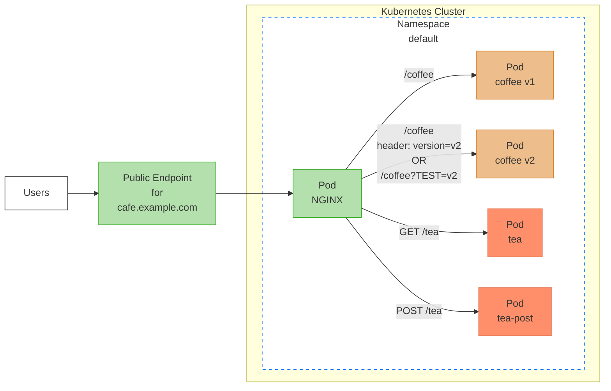

Learn how to deploy multiple applications and HTTPRoutes with request conditions such as paths, methods, headers, and query parameters

## Overview

In this guide we will configure advanced routing rules for multiple applications. These rules will showcase request matching by path (including prefix, exact, and regex patterns), headers, query parameters, and method. For an introduction to exposing your application, we recommend that you follow the [basic guide]() first.

The following image shows the traffic flow that we will be creating with these rules.



The goal is to create a set of rules that will result in client requests being sent to specific backends based on the request attributes. In this diagram, we have two versions of the `coffee` service. Traffic for v1 needs to be directed to the old application, while traffic for v2 needs to be directed towards the new application. We also have two `tea` services, one that handles GET operations and one that handles POST operations. Both the `tea` and `coffee` applications share the same Gateway.

## Before you begin

- [Install]() NGINX Gateway Fabric.

## Coffee applications

### Deploy the Coffee applications

Begin by deploying the `coffee-v1`, `coffee-v2` and `coffee-v3` applications:

```shell
kubectl apply -f https://raw.githubusercontent.com/nginx/nginx-gateway-fabric/v/examples/advanced-routing/coffee.yaml
```

### Deploy the Gateway API Resources for the Coffee applications

The [gateway](https://gateway-api.sigs.k8s.io/api-types/gateway/) resource is typically deployed by the [cluster operator](https://gateway-api.sigs.k8s.io/concepts/roles-and-personas/#roles-and-personas_1). To deploy the gateway:

```yaml
kubectl apply -f - <<EOF
apiVersion: gateway.networking.k8s.io/v1
kind: Gateway
metadata:
  name: cafe
spec:
  gatewayClassName: nginx
  listeners:
  - name: http
    port: 80
    protocol: HTTP
EOF
```

This gateway defines a single listener on port 80. Since no hostname is specified, this listener matches on all hostnames.
After creating the Gateway resource, NGINX Gateway Fabric will provision an NGINX Pod and Service fronting it to route traffic.

Save the public IP address and port of the NGINX Service into shell variables:

```text
GW_IP=XXX.YYY.ZZZ.III
GW_PORT=<port number>
```



In a production environment, you should have a DNS record for the external IP address that is exposed, and it should refer to the hostname that the gateway will forward for.



The [HTTPRoute](https://gateway-api.sigs.k8s.io/api-types/httproute/) is typically deployed by the [application developer](https://gateway-api.sigs.k8s.io/concepts/roles-and-personas/#roles-and-personas_1). To deploy the `coffee` HTTPRoute:

```yaml
kubectl apply -f - <<EOF
apiVersion: gateway.networking.k8s.io/v1
kind: HTTPRoute
metadata:
  name: coffee
spec:
  parentRefs:
  - name: cafe
    sectionName: http
  hostnames:
  - cafe.example.com
  rules:
  - matches:
    - path:
        type: PathPrefix
        value: /coffee
    backendRefs:
    - name: coffee-v1-svc
      port: 80
  - matches:
    - path:
        type: PathPrefix
        value: /coffee
      headers:
      - name: version
        value: v2
    - path:
        type: PathPrefix
        value: /coffee
      queryParams:
      - name: TEST
        value: v2
    backendRefs:
    - name: coffee-v2-svc
      port: 80
  - matches:
    - path:
        type: PathPrefix
        value: /coffee
      headers:
      - name: headerRegex
        type: RegularExpression
        value: "header-[a-z]{1}"
    - path:
        type: PathPrefix
        value: /coffee
      queryParams:
      - name: queryRegex
        type: RegularExpression
        value: "query-[a-z]{1}"
    backendRefs:
    - name: coffee-v3-svc
      port: 80
EOF
```

This HTTPRoute has a few important properties:

- The `parentRefs` references the gateway resource that we created, and specifically defines the `http` listener to attach to, via the `sectionName` field.
- `cafe.example.com` is the hostname that is matched for all requests to the backends defined in this HTTPRoute.
- The first rule defines that all requests with the path prefix `/coffee` and no other matching conditions are sent to the `coffee-v1` Service.
- The second rule defines two matching conditions. If *either* of these conditions match, requests are forwarded to the `coffee-v2` Service:

  - Request with the path prefix `/coffee` and header `version=v2`.
  - Request with the path prefix `/coffee` and the query parameter `TEST=v2`.

   The match type is `Exact` for both header and query param, by default. 

- The third rule defines two matching conditions. If *either* of these conditions match, requests are forwarded to the `coffee-v3` Service:

  - Request with the path prefix `/coffee` and header `HeaderRegex=Header-[a-z]{1}`.
  - Request with the path prefix `/coffee` and the query parameter `QueryRegex=Query-[a-z]{1}`.

   The match type used here is `RegularExpression`. A request will succeed if the header or query parameter value matches the specified regular expression. 

  If you want both conditions to be required, you can define headers and queryParams in the same match object.

### Send traffic to Coffee

Using the external IP address and port for the NGINX Service, we can send traffic to our coffee applications.

 If you have a DNS record allocated for `cafe.example.com`, you can send the request directly to that hostname, without needing to resolve. 

```shell
curl --resolve cafe.example.com:$GW_PORT:$GW_IP http://cafe.example.com:$GW_PORT/coffee
```

This request should receive a response from the `coffee-v1` Pod.

```text
Server address: 10.244.0.9:8080
Server name: coffee-v1-76c7c85bbd-cf8nz
```

If we want our request to be routed to `coffee-v2`, then we need to meet the defined conditions. We can include a header:

```shell
curl --resolve cafe.example.com:$GW_PORT:$GW_IP http://cafe.example.com:$GW_PORT/coffee -H "version:v2"
```

or include a query parameter:

```shell
curl --resolve cafe.example.com:$GW_PORT:$GW_IP http://cafe.example.com:$GW_PORT/coffee?TEST=v2
```

Either request should result in a response from the `coffee-v2` Pod.

```text
Server address: 10.244.0.9:8080
Server name: coffee-v2-68bd55f798-s9z5q
```

If we want our request to be routed to `coffee-v3`, then we need to meet the defined conditions. We can include a header matching the regular expression:

```shell
curl --resolve cafe.example.com:$GW_PORT:$GW_IP http://cafe.example.com:$GW_PORT/coffee -H "headerRegex:header-a"
```

or include a query parameter matching the regular expression:

```shell
curl --resolve cafe.example.com:$GW_PORT:$GW_IP http://cafe.example.com:$GW_PORT/coffee?queryRegex=query-a
```

Either request should result in a response from the `coffee-v3` Pod.

```text
Server address: 10.244.0.104:8080
Server name: coffee-v3-66d58645f4-6zsl2
```

## Tea applications

Let's deploy a different set of applications now called `tea` and `tea-post`. These applications will have their own set of rules, but will still attach to the same gateway listener as the `coffee` apps.

### Deploy the Tea applications

```shell
kubectl apply -f https://raw.githubusercontent.com/nginx/nginx-gateway-fabric/v/examples/advanced-routing/tea.yaml
```

### Deploy the HTTPRoute for the Tea services

We are reusing the previous gateway for these applications, so all we need to create is the HTTPRoute.

```yaml
kubectl apply -f - <<EOF
apiVersion: gateway.networking.k8s.io/v1
kind: HTTPRoute
metadata:
  name: tea
spec:
  parentRefs:
  - name: cafe
  hostnames:
  - cafe.example.com
  rules:
  - matches:
    - path:
        type: PathPrefix
        value: /tea
      method: POST
    backendRefs:
    - name: tea-post-svc
      port: 80
  - matches:
    - path:
        type: PathPrefix
        value: /tea
      method: GET
    backendRefs:
    - name: tea-svc
      port: 80
EOF
```

The properties of this HTTPRoute include:

- The same gateway is referenced as before.
- The same hostname is used as with the `coffee` apps.
- The first rule defines that a POST request to the `/tea` path is routed to the `tea-post` Service.
- The second rule defines that a GET request to the `/tea` path is routed to the `tea` Service.

### Send traffic to Tea

Using the external IP address and port for the NGINX Service, we can send traffic to our tea applications.

 If you have a DNS record allocated for `cafe.example.com`, you can send the request directly to that hostname, without needing to resolve. 

```shell
curl --resolve cafe.example.com:$GW_PORT:$GW_IP http://cafe.example.com:$GW_PORT/tea
```

This GET request should receive a response from the `tea` Pod.

```text
Server address: 10.244.0.10:8080
Server name: tea-df5655878-5fmfg
```

If we want our request to be routed to `tea-post`, then we need to send a POST request:

```shell
curl --resolve cafe.example.com:$GW_PORT:$GW_IP http://cafe.example.com:$GW_PORT/tea -X POST
```

```text
Server address: 10.244.0.7:8080
Server name: tea-post-b59b8596b-g586r
```

This request should receive a response from the `tea-post` pod. Any other type of method, such as PATCH, will result in a `404 Not Found` response.

## Path matching types

NGINX Gateway Fabric supports three types of path matching:

- **PathPrefix**: Matches based on a URL path prefix split by `/`. For example, `/coffee` matches `/coffee`, `/coffee/`, and `/coffee/latte`.
- **Exact**: Matches the exact path in the request. For example, `/coffee` matches only `/coffee`.
- **RegularExpression**: Matches based on RE2-compatible regular expressions. For example, `/coffee/[a-z]+` matches `/coffee/latte` and `/coffee/mocha` but not `/coffee/123`.

 Regular expression path matching uses the RE2 syntax. Patterns are automatically anchored to the beginning of the path. 

### Example: Using regex path matching

To route requests based on regex patterns in the path, use `type: RegularExpression`:

```yaml
kubectl apply -f - <<EOF
apiVersion: gateway.networking.k8s.io/v1
kind: HTTPRoute
metadata:
  name: coffee-regex
spec:
  parentRefs:
  - name: cafe
  hostnames:
  - cafe.example.com
  rules:
  - matches:
    - path:
        type: RegularExpression
        value: /coffee/[a-z]+
    backendRefs:
    - name: coffee-v1-svc
      port: 80
EOF
```

This configuration routes requests like `/coffee/latte` or `/coffee/mocha` to the `coffee-v1-svc` backend, while paths like `/coffee/123` or `/coffee` will not match.

#### Send traffic using regex paths

You can test the regex path matching with curl:

```shell
curl --resolve cafe.example.com:$GW_PORT:$GW_IP http://cafe.example.com:$GW_PORT/coffee/latte
```

This request should receive a response from the `coffee-v1` Pod since `/coffee/latte` matches the pattern `/coffee/[a-z]+`.

```text
Server address: 10.244.0.9:8080
Server name: coffee-v1-76c7c85bbd-cf8nz
```

However, a request with a numeric path segment will not match:

```shell
curl --resolve cafe.example.com:$GW_PORT:$GW_IP http://cafe.example.com:$GW_PORT/coffee/123
```

This will result in a `404 Not Found` response since `/coffee/123` does not match the pattern `/coffee/[a-z]+`.

## Troubleshooting

If you have any issues while sending traffic, try the following to debug your configuration and setup:

- Make sure you set the shell variables $GW_IP and $GW_PORT to the public IP and port of the NGINX service. Refer to the [Installation]() guides for more information.

- Check the status of the Gateway:

  ```shell
  kubectl describe gateway cafe
  ```

  The Gateway status should look like this:

  ```text
  Status:
  Addresses:
    Type:   IPAddress
    Value:  10.244.0.85
  Conditions:
    Last Transition Time:  2023-08-15T20:57:21Z
    Message:               Gateway is accepted
    Observed Generation:   1
    Reason:                Accepted
    Status:                True
    Type:                  Accepted
    Last Transition Time:  2023-08-15T20:57:21Z
    Message:               Gateway is programmed
    Observed Generation:   1
    Reason:                Programmed
    Status:                True
    Type:                  Programmed
  Listeners:
    Attached Routes:  2
    Conditions:
      Last Transition Time:  2023-08-15T20:57:21Z
      Message:               Listener is accepted
      Observed Generation:   1
      Reason:                Accepted
      Status:                True
      Type:                  Accepted
      Last Transition Time:  2023-08-15T20:57:21Z
      Message:               Listener is programmed
      Observed Generation:   1
      Reason:                Programmed
      Status:                True
      Type:                  Programmed
      Last Transition Time:  2023-08-15T20:57:21Z
      Message:               All references are resolved
      Observed Generation:   1
      Reason:                ResolvedRefs
      Status:                True
      Type:                  ResolvedRefs
      Last Transition Time:  2023-08-15T20:57:21Z
      Message:               No conflicts
      Observed Generation:   1
      Reason:                NoConflicts
      Status:                False
      Type:                  Conflicted
    Name:                    http
  ```

  Check that the conditions match and that the attached routes for the `http` listener equals 2. If it is less than 2, there may be an issue with the routes.

- Check the status of the HTTPRoutes:

  ```shell
  kubectl describe httproute coffee
  ```

  ```shell
  kubectl describe httproute tea
  ```

  Each HTTPRoute status should look like this:

  ```text
  Status:
    Parents:
      Conditions:
        Last Transition Time:  2023-08-15T20:57:21Z
        Message:               The route is accepted
        Observed Generation:   1
        Reason:                Accepted
        Status:                True
        Type:                  Accepted
        Last Transition Time:  2023-08-15T20:57:21Z
        Message:               All references are resolved
        Observed Generation:   1
        Reason:                ResolvedRefs
        Status:                True
        Type:                  ResolvedRefs
      Controller Name:         gateway.nginx.org/nginx-gateway-controller
      Parent Ref:
        Group:      gateway.networking.k8s.io
        Kind:       Gateway
        Name:       cafe
        Namespace:  default
  ```

  Check for any error messages in the conditions.

## See also

To learn more about the Gateway API and the resources we created in this guide, check out the following Kubernetes documentation resources:

- [Gateway API Overview](https://gateway-api.sigs.k8s.io/concepts/api-overview/)
- [Deploying a simple Gateway](https://gateway-api.sigs.k8s.io/guides/simple-gateway/)
- [HTTP Routing](https://gateway-api.sigs.k8s.io/guides/http-routing/)
