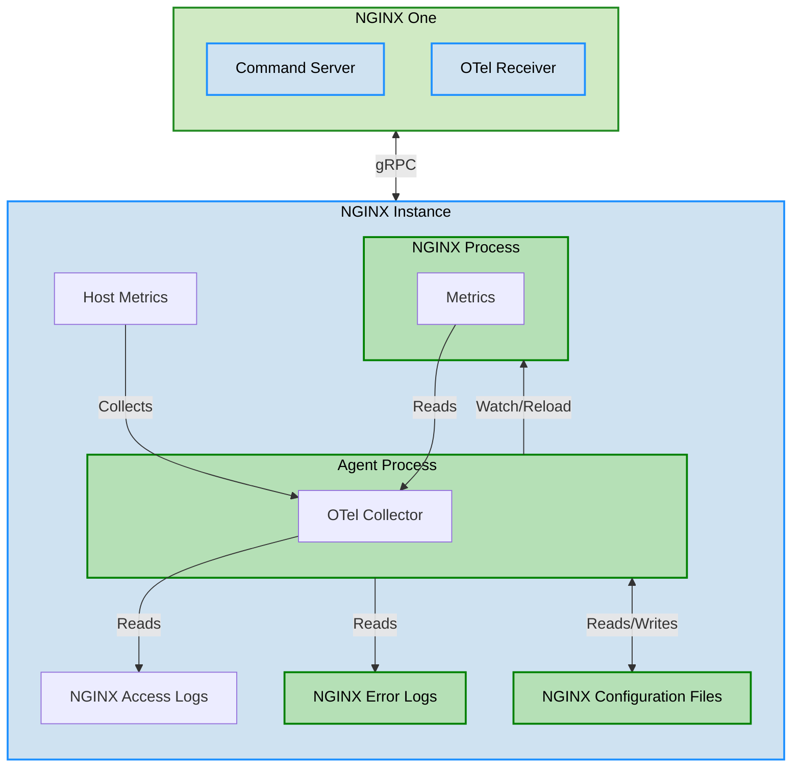





## Architecture

```mermaid
graph BT

    %% Define colors for the subgraphs
    style ManagementPlane fill:#d0eac4,stroke:#228B22,stroke-width:2px,color:#000000
    style CommandControl fill:#cfe2f1,stroke:#1E90FF,stroke-width:2px,color:#000000
    style OTelManagementPlane fill:#cfe2f1,stroke:#1E90FF,stroke-width:2px,color:#000000
    style Compute fill:#cfe2f1,stroke:#1E90FF,stroke-width:2px,color:#000000
    style NGINX fill:#b5e0b6,stroke:#008000,stroke-width:2px,color:#000000
    style NGINXConfig fill:#b5e0b6,stroke:#008000,stroke-width:2px,color:#000000
    style ErrorLogs fill:#b5e0b6,stroke:#008000,stroke-width:2px,color:#000000
    style Agent fill:#b5e0b6,stroke:#008000,stroke-width:2px,color:#000000

    subgraph ManagementPlane["NGINX One"]
        CommandControl["Command Server"]
        OTelManagementPlane["OTel Receiver"]
    end

    subgraph Compute["NGINX Instance"]
        subgraph Agent["Agent Process"]
            OTelDataPlane["OTel Collector"]
        end

        subgraph NGINX["NGINX Process"]
            NGINXMetrics["Metrics"]
        end
        NGINXConfig["NGINX Configuration Files"]
        ErrorLogs["NGINX Error Logs"]

        Metrics["Host Metrics"] --> |Collects| OTelDataPlane
        NGINXMetrics --> |Reads| OTelDataPlane["OTel Collector"]
        Agent --> |Watch/Reload| NGINX
        Agent --> |Reads| ErrorLogs
        OTelDataPlane --> |Reads| AccessLogs["NGINX Access Logs"]
        Agent <--> |Reads/Writes| NGINXConfig
    end

    Compute <--> |gRPC| ManagementPlane
```


