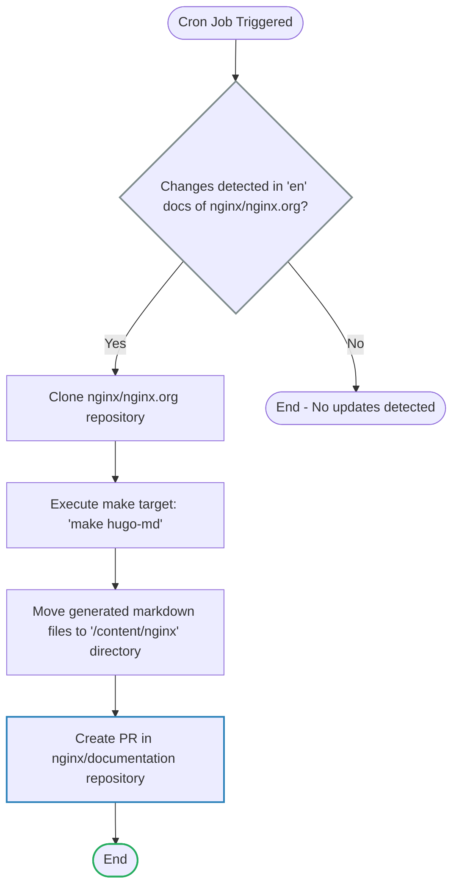

# nginx.org content

This document describes the process by which https://github.com/nginx/nginx.org are ingested by the `nginx/documentation` repository, and rendered as markdown.

## Source of truth
The https://github.com/nginx/nginx.org repository remains the source of truth for a subset of content in `/content/nginx`. Primarily, this includes is the `module reference`, and the https://github.com/nginx/nginx.org/blob/main/yaml/nginx_api.yaml.

Any modifications to these autogenerated files will be blocked during the pull request process.
If modifications are required, they will be made in the source xml in https://github.com/nginx/nginx.org repository.

All files that are autogenerated from this source, will have the warning:

```md
********************************************************************************
🛑 WARNING: AUTOGENERATED FILE - DO NOT EDIT 🛑 This Markdown file was
automatically generated from the source XML documentation. Any manual
changes made directly to this file will be overwritten. To request or
suggest changes, please edit the source XML files instead.
https://github.com/nginx/nginx.org/tree/main/xml/en
********************************************************************************
```

## Markdown generation flow

A GitHub Action running as a cron job in the `nginx/documentation` repository detects changes in the documentation within `nginx/nginx.org`, generates new markdown files when changes are found, and creates a PR with these changes.

Only PRs generated by this GitHub Action can be merged.

The markdown files are generated using a markdown-specific XSLT file, which targets only the XML sources intended for inclusion in the nginx/documentation repository.


