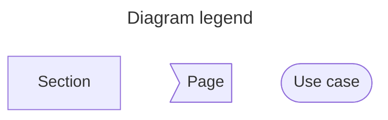
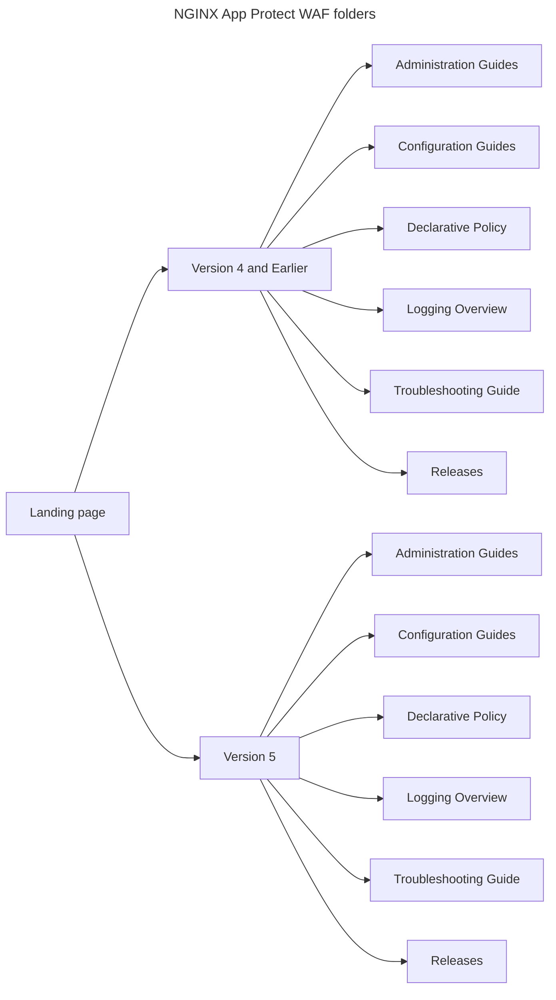
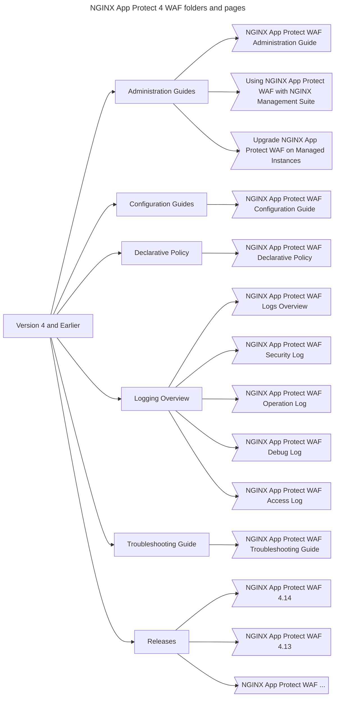
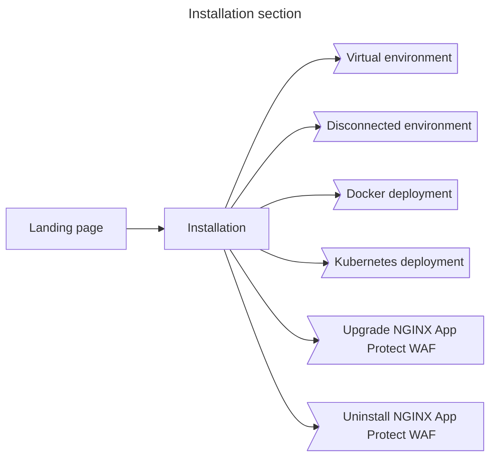
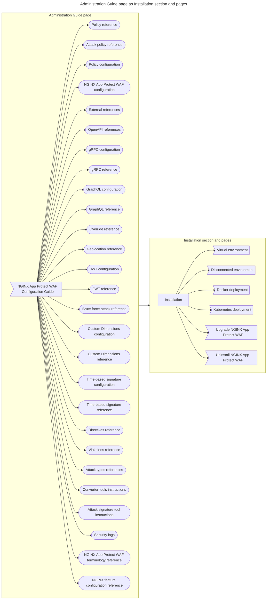
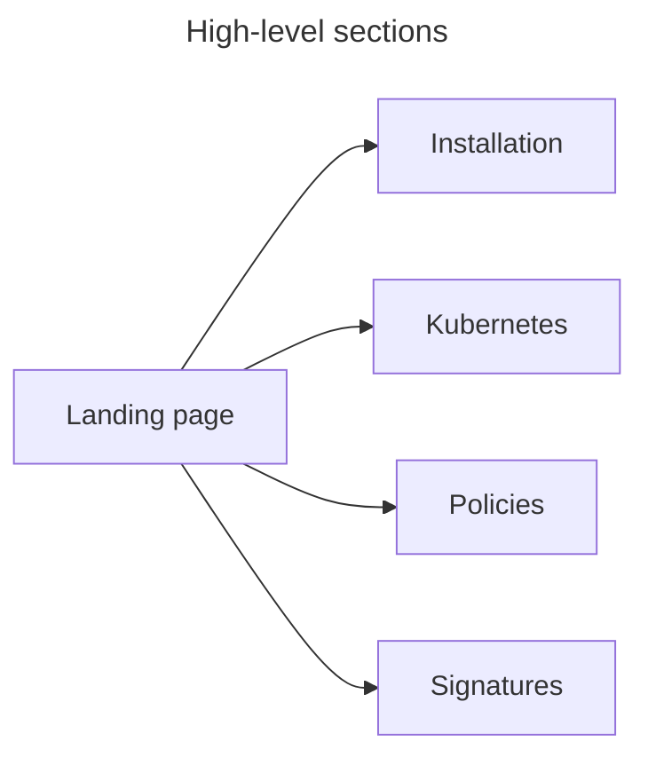

# NGINX App Protect WAF Documentation Refactor

_Author_: Alan Dooley (@adubhlaoich)  
_Initial review date_: May 14th, 2025  
_Internal stakeholders_: NGINX App Protect WAF team, NGINX Ingress Controller team  
_Status_: **Accepted**

_Relevant information_:
- [NGINX App Protect WAF documentation](https://docs.nginx.com/nginx-app-protect-waf)
- [NGINX Ingress Controller documentation (Integrations)](https://docs.nginx.com/nginx-ingress-controller/installation/integrations/)

## Introduction

This proposal describes my observations about the NGINX App Protect WAF documentation set, and my plan for how to address its problems. 

It will be shared with stakeholders to challenge or verify certain assumptions and to give the affected teams advance warning, as the changes involved are substantial.

For clarity, here is a legend for the diagrams:

- A _section_ is a grouping of pages
- A _page_ is a single document, made up of one or more use cases
- A _use case_ is a set of instructions for a specific topic

Understanding the relationship between pages and use cases is crticially important to contextualise the impact of how certain pages are currently structured.

## Issues identified

### Content duplication

At the highest level, there is a gigantic amount of duplication from [the landing page](https://docs.nginx.com/nginx-app-protect-waf) to account for the V4/V5 split.

To emphasize this duplication, I have illustrated the high level sections, which are identical.

At initial glance, this does not seem overly complex outside of deployment and v5-specific features.

As it stands, the majority of NAP documentation between the V4 and V5 branches are identical - they have the same pages and same sections. 

Where they deviate are how they are deployed, and and what features are available. In the latter case, it seems that all of the newer functionality features are in V5.

I think the structure reflects an earlier intent for V5/X to completely replace/subsume 4, which didn’t occur in the end, requiring that both sets of documentation be maintained concurrently, in contrast to documentation for 4 being archived.

As a result, humongous amounts of the content is replicated, which lead an over-use of includes.

Each "step" through these folders is an additional user interaction when navigating through the sidebar. 

Focusing on a v4 diagram which includes include the individual pages illustrates some of the highest level differences, as well as the single page folder pattern we avoid in other product documentation.

### Monolithic pages

Many NGINX App Protect pages are typically “only child” documents within folders, creating unnecessary nesting. 

Beyond that, a handful of critically important documents encapulsate all information related to a single type of use case. This means that every possible permutation of installation documentation and related documentation (Migration, upgrade, uninstallation) all exist in the same document.

This leads to a huge amount of reading fatigue, and maintaining this pattern has also lead context-independent information being placed inside these monolithic pages with no real relationship to other sections. A similar issue can also be identified in the configuration document.

```mermaid
---
title: NGINX App Protect 4 monolithic pages and use cases
---
graph LR

    v4[Version 4 and Earlier]

    4ad[Administration Guides]
    4conf[Configuration Guides]

    v4 --> 4ad
    v4 --> 4conf


    4adp>NGINX App Protect WAF Administration Guide]

    4ad --> 4adp

    4adbm([Bare metal installation])
    4addd([Docker installation])
    4adct([Converter tool])
    4adag([Air-gapped installation])
    4adpi([Post-installation checks])
    4adas([Updating attack signatures])
    4adtc([Updating threat campaigns])
    4adbs([Updating bot signatures])
    4adug([Upgrading App Protect])
    4adut([Uninstalling App Protect])
    4adsv([Upgrading App Protect to a specific version])
    4adlv([Upgrading App Protect to the latest version])
    4adse([Configuring SE Linux])

    4adp --> 4adbm
    4adp --> 4addd
    4adp --> 4adct
    4adp --> 4adag
    4adp --> 4adpi
    4adp --> 4adas
    4adp --> 4adtc
    4adp --> 4adbs
    4adp --> 4adug
    4adp --> 4adut
    4adp --> 4adsv
    4adp --> 4adlv
    4adp --> 4adse

    4conp>NGINX App Protect WAF Configuration Guide]

    4conf --> 4conp

    4conppref([Policy reference])
    4conparef([Attack policy reference])
    4conppcon([Policy configuration])
    4conpwcon([NGINX App Protect WAF configuration])
    4conpexr([External references])
    4conpoar([OpenAPI references])
    4conpgrpc([gRPC configuration])
    4conpgrpr([gRPC reference])
    4conpgqlc([GraphQL configuration])
    4conpgqlr([GraphQL reference])
    4conporr([Override reference])
    4conpgeor([Geolocation reference])
    4conpjwtc([JWT configuration])
    4conpjwtr([JWT reference])
    4conpbfar([Brute force attack reference])
    4conpcdc([Custom Dimensions configuration])
    4conpcdr([Custom Dimensions reference])
    4conptbsc([Time-based signature configuration])
    4conptbsr([Time-based signature reference])
    4conpdirr([Directives reference])
    4conpvior([Violations reference])
    4conpattr([Attack types references])
    4conpcti([Converter tools instructions])
    4conpasti([Attack signature tool instructions])
    4conpsl([Security logs])
    4conpterr([NGINX App Protect WAF terminology reference])
    4conpnconr([NGINX feature configuration reference])

    4conp --> 4conppref
    4conp --> 4conparef
    4conp --> 4conppcon
    4conp --> 4conpwcon
    4conp --> 4conpexr
    4conp --> 4conpoar
    4conp --> 4conpgrpc
    4conp --> 4conpgrpr
    4conp --> 4conpgqlc
    4conp --> 4conpgqlr
    4conp --> 4conporr
    4conp --> 4conpgeor
    4conp --> 4conpjwtc
    4conp --> 4conpjwtr
    4conp --> 4conpbfar
    4conp --> 4conpcdc
    4conp --> 4conpcdr
    4conp --> 4conptbsc
    4conp --> 4conptbsr
    4conp --> 4conpdirr
    4conp --> 4conpvior
    4conp --> 4conpattr
    4conp --> 4conpcti
    4conp --> 4conpasti
    4conp --> 4conpsl
    4conp --> 4conpterr
    4conp --> 4conpnconr

```

This pattern was enabled by an over-use of includes, where includes were being treated as whole pages since the content was being duplicated across the separate folders.

Since taking responsibility for the documentation set, I removed all include files that were being used in only one place, which appeared to be a way for documentation authors to compartmentalize their updates without considering the user experience of the documentation set as a whole.

## Proposed changes

Overall, the whole documentation set can be flattened down into one set of documentation, though the parallel maintenance of V4 and development of V5 mean that features exclusive to V5 will need to be clearly differentiated.

I will remove duplicate content, and subsequently remove any excess and redundant include files. V5-specific content will be delineated with their own pages and given a unique page template to explicitly mark that they only apply to V5.

As part of this effort, the current monolithic pages will be split into self-contained single topics, grouped by use case. As they are grouped together this way, they will be named and ordered to match other NGINX products so that customers within the ecosystem have a consistent experience across the whole portfolio.

To exemplify what this could look like, I will provide examples of a few new sections with their own diagrams.

### Installation section

The current “NGINX App Protect WAF Administration Guide” page will be broken into an “Installation” section, similar to other product sets. V4 and V5 instructions will be delineated with tabs, sections or entire pages, depending on the amount of content and functionality available from the website.

Here are examples of what the individual pages may be:

- "Bare metal" deployment
- Docker deployment
- Kubernetes deployment (V5 specific)
- Offline deployment (Possibly called "Airgapped", or "Disconnected environment".)

The Administration Guide also has a number of post-installation steps which can be turned into discrete pages, juxtaposted to the important parts of the user journey in other documents.

- Upgrade NGINX App Protect
- Uninstall NGINX App Protect

The remaining information can be grouped into other use cases

- Update NGINX App Protect Signatures
- Configure SELinux for NGINX App Protect

For comparison, here is a "before" and "after" diagram showing the prior Administration Guide page and its use cases, and the new single-focus Installation section.

### Other use cases

Beyond the administration guide, the “NGINX App Protect WAF Configuration Guide” is the second largest monolithic page, which can also be broken down into individual pages and sections.

- Configuring NAP WAF itself
- Policies
- Attack signatures
- References

Here are some examples of what that might look like as high-level sections: instead of grouping sections by "type" of instruction (such as Configuration), they are instead grouped into use cases.

The documentation related to NGINX App Protect WAF currently stored within the NGINX Ingress Controller documentation set would be migrated to instead be managed and stored within the NGINX App Protect WAF documentation. The V4/V5 split that created the current state of the documentation's IA was also inherited by NGINX Ingress Controller. 

### Move Troubleshooting information into contextual pages

We try to avoid two kinds of pages: Frequently asked questions, and Troubleshooting guides. 

In the latter case, the context-specific troubleshooting information will be added to their use case pages. Further investigation will likely lead to notes or warnings about common or necessary user actions to avoid the need to troubleshoot at all.

### Create a Support page

A singular Support page will be created, matching the format of existing Support pages for other products - there is likely already an include to explain the F5 support policy and where a customer should go to engage with it. 

V4 and V5 have different ways to access logs, so they can be given their own discrete instructions, whether as sections or tabs.

## Remediation

Once the proposal has been accepted, the first step is to organise the pages into their new sections.

This effort has a few stages, some of which have been done as part of planning this proposal:

- Identifying use cases
- Finding logical groupings for contextually sensitive information
- Creating new pages for the information
- Updating the supporting metadata
- Creating redirects for prior production URLS to support existing links

Once the new pages have been created, a second pass can be done to refactor the content:

- Restructure page-level information architecture to reduce hops
- Create logical links between sections of different pages based on common user journeys
- Identify critical content for text re-use as includes
- Remove redundant content, in the form of body text or include fragments

At this point, it should be much simpler to address technical debt in the documentation backlog, which will enable improvements to content beyond technical accuracy and completeness.